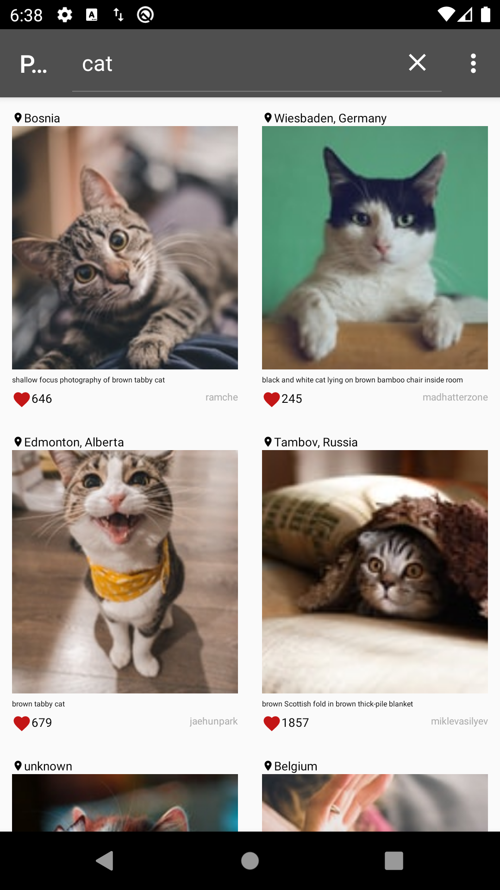

# PictureFinder
Simple application to show Clean architecture approach. 
* For MVP implementation used Moxy. 
* For network requests used Retrofit2 + Gson
* For background requests used Kotlin courutines
* For image displaying used Glide
* For DI implementation used Dagger2
* For navigation between fragments used Navigation component by Google. 

To make navigation simpler:
https://github.com/danilNikolaenko1990/PictureFinder/tree/master/app/src/main/java/com/daniln/picturefinder

The goal of this sample was to illustrate how to use Dagger2 with Retsrofit2 and courutines, because there were many examples 
how to use retrofit and RxJava but I didn't find any examples how to use Retrofit and courutines according to "Clean architecture" recommendations.
If you want to run application by yourself just find file TokenInterceptor.kt and add your application token.
The application uses unsplash images api. 

  

